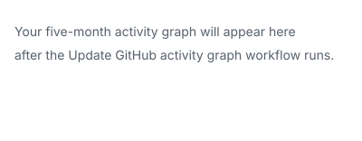

<div align="center">

# Kedar Damale

### Applied Data Scientist · ML Engineer · GenAI Engineer

I build production-focused machine learning and GenAI systems for financial automation, analytics, pharmaceutical intelligence, and research.

From data pipelines and predictive models to RAG, agentic systems, computer vision, and production deployment.

<br/>

<a href="https://kedardamale.github.io/KedarDamale/">
  
</a>
<a href="https://www.linkedin.com/in/kedar-damale-57252a324/">
  
</a>
<a href="https://kedardamale.github.io/KedarDamale/main.pdf">
  
</a>
<a href="mailto:damalekedar@gmail.com">
  
</a>

</div>

## Local ATS Resume Review

`make resume` compiles `resume/main.tex`, saves a dated PDF snapshot in `portfolio/resume-YYYYMMDD.pdf`, and refreshes the stable `portfolio/main.pdf` copy. `make ats` uses that stable PDF by default and asks for a target role, company context, optional job description, provider, model, and reasoning effort.

```sh
make ats
```

Paste company context and the job description, finishing each with a line containing only `.`. Enter `none` on the first line when you do not have company context or a job description. The review scans substantive public GitHub project READMEs through `gh`, compares current evidence against the target, scores the resume out of 100, and estimates the impact of truthful edits and future skill/project work. GitHub scanning needs an authenticated `gh` CLI.

The interactive flow lists installed providers and offers provider-specific model and effort options. Codex includes GPT-6 Astra/Sol/Luna and GPT-5.6 Sol/Terra/Luna, plus a custom model ID. For scripted runs, use `python3 scripts/ats.py --resume portfolio/main.pdf --role "Data Scientist" --job-description job.txt --provider codex --model gpt-5.6-terra --effort high`.

To use OpenRouter explicitly, set `OPENROUTER_API_KEY` and run with `--provider openrouter`. Its default model is `openrouter/auto`; ATS requests the `max` quality tier and prints the concrete model selected when the response arrives. Standard pricing for that model applies. Use `ATS_OPENROUTER_MODEL` to pin a model ID.

### Connect it to an MCP client

The local MCP server exposes `ats_review_resume` and `ats_setup`. Run `make ats-setup` for commands and configuration snippets for Codex, Claude Code, GitHub Copilot CLI, and Antigravity. For example:

```sh
codex mcp add ats -- python3 "$PWD/scripts/ats_mcp.py"
claude mcp add --transport stdio ats -- python3 "$PWD/scripts/ats_mcp.py"
copilot mcp add ats -- python3 "$PWD/scripts/ats_mcp.py"
```

Antigravity can use the same stdio server from its MCP manager or its `mcp_config.json`. Set `OPENROUTER_API_KEY` in the MCP host's environment to route MCP reviews through OpenRouter Auto. The MCP server also has an `ats_setup` tool and an `ats://setup` resource with these instructions.

---

## About

I am an ML and GenAI Engineer focused on building AI systems that move beyond prototypes and operate on real business data.

My work spans financial automation, large-scale analytical systems, agentic AI, machine learning, computer vision, data engineering, and production deployment.

|                   |                                                                                 |
| ----------------- | ------------------------------------------------------------------------------- |
| **Current Role**  | ML & GenAI Engineer at Globalspace Technologies Ltd.                            |
| **Experience**    | 1+ years across ML, GenAI, automation, data systems, and production engineering |
| **Education**     | Information Technology Engineering, University of Mumbai                        |
| **Academic**      | 8.5 CGPA · GATE DA 2026 Qualified                                               |
| **Primary Focus** | Applied ML · GenAI · Agentic Systems · Financial Automation · Analytics         |

---

## Selected Impact

<table>
<tr>
<td align="center" width="25%">
<h3>3M+</h3>
Pharmaceutical sales and tender records used by an agentic analytical system
</td>
<td align="center" width="25%">
<h3>10,000+</h3>
Invoices processed through automated financial reconciliation
</td>
<td align="center" width="25%">
<h3>&gt;99.9%</h3>
Reduction in reconciliation processing time versus the previous manual workflow
</td>
<td align="center" width="25%">
<h3>98.57%</h3>
Chess-piece detection accuracy across 500+ test images
</td>
</tr>
</table>

---

# Employment Journey

My career so far has followed one consistent direction:

**automating repetitive workflows → building intelligent decision systems → engineering production AI**

**Start** → **Propelligence Advisors** · Freelance Automation Developer · May 2025–Jan 2026  
*Financial automation*

↓

**Globalspace Technologies Ltd.** · ML & GenAI Engineer · Jan 2026–Present  
*ML + GenAI systems*

↓

**Present**

---

## Stop 02 — Globalspace Technologies Ltd.

**ML & GenAI Engineer**
**January 2026 — Present**

Building AI, ML, analytics, and automation systems across pharmaceutical intelligence, financial workflows, auditing, and enterprise decision support.

### GSTL PatGPT — Zydus

Agentic analytical system operating across **3M+ pharmaceutical sales and tender records**.

Built to support:

* historical analysis
* forecasting workflows
* simulation
* multi-step analytical planning
* evidence-grounded answers
* human review checkpoints
* analytical tool orchestration

The system translates complex analytical questions into structured execution plans and coordinates the required data and reasoning tools.

### Granska

AI-enabled auditing and financial review platform focused on reducing manual work across accounting and audit workflows.

Areas include:

* automated reconciliation
* financial-data ingestion
* review workflows
* anomaly detection
* analytical tooling
* audit automation
* structured financial analysis

### GSTL AI CSO

AI-assisted strategic decision-support system designed to help transform business data into structured analysis and decision context.

### GSTL Budget Automation

Designed a unified organizational hierarchy model and dynamic scoring system for incentive and budget calculations.

The architecture was designed to scale calculations across **thousands of employees** while keeping scoring rules configurable and maintainable.

---

## Stop 01 — Propelligence Advisors

**Freelance Automation Developer**
**May 2025 — January 2026**

This was where my work moved from software experimentation into solving real operational problems.

### Automated PR-to-GSTR-2B Reconciliation

Built an automated reconciliation system for matching purchase-register records with GSTR-2B tax records.

The system processed **10,000+ invoices** using:

* Polars
* RapidFuzz
* normalization pipelines
* fuzzy entity matching
* rule-based reconciliation
* automated report generation

A workflow that previously required approximately **5–6 days of manual work** could be processed automatically, reducing processing time by more than **99.9%**.

The solution later became part of an audit workflow used by **two CA firms and approximately 20 auditors**.

---

# Selected Personal Projects

## NeuroTRIBE

**Computational neuroscience · fMRI · Research infrastructure**

[View Repository](https://github.com/KedarDamale/NeuroTribe)

Cortical-response analysis on Healthy Brain Network movie-fMRI data, comparing participants with ADHD against a matched cohort.

Built around reproducible analytical workflows and containerized research infrastructure.

`TRIBE v2` `fMRI` `Python` `Docker Compose`

---

## Chessablanka

**Computer Vision · Chess · Object Detection**

[View Repository](https://github.com/KedarDamale/Chessablanka)

Reads a physical chess position from an image, reconstructs the board state, and evaluates the resulting position using Stockfish.

Achieved **98.57% detection accuracy across 500+ test images**.

`YOLOv8` `Roboflow` `OpenCV` `Stockfish` `Python`

---

## ESP32 DBSCAN Cattle Monitoring System

**IoT · Geospatial Analytics · Clustering**

[View Repository](https://github.com/KedarDamale/ESP32-DBSCAN-Cattle-Monitoring-System)

Distributed cattle-monitoring system combining GPS and RSSI measurements from ESP32 devices.

DBSCAN is used to identify grazing zones and spatial behavior, with results displayed through a live monitoring dashboard.

`ESP32` `DBSCAN` `Flask` `MongoDB` `Next.js`

---

## Automated Reconciliation

**FinTech · Financial Automation · Entity Matching**

[View Repository](https://github.com/KedarDamale/automated_reconcillation)

Automated financial reconciliation engine for matching purchase records against tax records and producing review-ready outputs.

`Python` `Polars` `RapidFuzz` `Fuzzy Matching`

---

## StudyONE

**Full-Stack Learning Platform**

[View Repository](https://github.com/KedarDamale/StudyONE)

Full-stack student productivity and collaboration platform combining learning tools, speech-to-text capabilities, and collaborative workflows.

`MERN` `TypeScript` `Speech-to-Text` `Collaboration`

---

## Cricket Match Summarizer

**NLP · Information Extraction · Sports Analytics**

[View Repository](https://github.com/KedarDamale/Cricket-Match-Summarizer)

Processes ball-by-ball cricket commentary, extracts match events, and applies rule-based analytical logic to identify possible team strategies and patterns.

`Python` `NLP` `Web Scraping` `Rule-Based Analytics`

---

<details>
<summary><b>Additional Projects</b></summary>

<br/>

### Automated UI Flow Maker

[Repository](https://github.com/KedarDamale/Automated-UI-flow-maker)

Experiment in representing interface interactions as repeatable, code-driven UI workflows.

`Python` `UI Automation`

---

### StudyONE Drawing Board

[Repository](https://github.com/KedarDamale/StudyONE-DrawingBoard)

Drawing-board companion for collaborative learning and visual explanations.

`TypeScript`

---

### MarksMania

[Repository](https://github.com/KedarDamale/MarksMania)

JavaScript-based learning and assessment application.

`JavaScript` `Web`

---

### GroceryShopONE

[Repository](https://github.com/KedarDamale/GroceryShopONE)

Flask application for managing shop operations and records.

`Python` `Flask`

---

### Music Downloader

[Repository](https://github.com/KedarDamale/Music-Downloader)

Python utility for downloading audio from supported sources.

`Python`

</details>

---

# Engineering Stack

## Data Science and Machine Learning

`Python`
`SQL`
`NumPy`
`Pandas`
`Polars`
`scikit-learn`
`XGBoost`
`PyTorch`
`YOLOv8`
`OpenCV`

## Generative AI

`LLMs`
`RAG`
`Agentic Systems`
`Multi-Agent Systems`
`LangChain`
`LangGraph`
`MCP`
`Human-in-the-Loop`
`Tool Calling`
`Structured Outputs`

## Backend and Data Systems

`FastAPI`
`Flask`
`PostgreSQL`
`MongoDB`
`Redis`
`REST APIs`
`Data Pipelines`

## MLOps and Infrastructure

`Docker`
`AWS`
`MLflow`
`Git`
`GitHub`
`Linux`

## Languages and Web

`Python`
`SQL`
`TypeScript`
`JavaScript`
`Go`
`React`
`Next.js`

---

# What I Like Building

I am particularly interested in systems where machine learning is only one part of the solution.

That includes:

* analytical agents that coordinate multiple tools
* production RAG systems
* multi-agent architectures
* financial and audit automation
* intelligent data pipelines
* predictive analytics
* computer vision systems
* ML systems connected to real operational workflows
* human-in-the-loop AI
* systems that turn large datasets into actionable decisions

---

# Current GitHub Activity

<a href="https://github.com/KedarDamale?tab=overview">
  
</a>

---

<div align="center">

### Building systems that turn data into decisions and repetitive work into automation.

[Portfolio](https://kedardamale.github.io/KedarDamale/)
  ·  
[LinkedIn](https://www.linkedin.com/in/kedar-damale-57252a324/)
  ·  
[Resume](https://kedardamale.github.io/KedarDamale/main.pdf)
  ·  
[Email](mailto:damalekedar@gmail.com)

</div>
