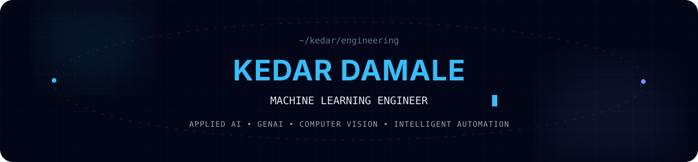

<div align="center">



<br/>

<a href="https://readme-typing-svg.demolab.com">
  
</a>

<br/>

<a href="https://github.com/KedarDamale"></a>
<a href="https://www.linkedin.com/in/kedar-damale-57252a324/"></a>
<a href="https://www.kaggle.com/kedarpdamale"></a>

<br/><br/>


</div>

## 👋 About me

I'm a **Machine Learning Engineer** focused on building practical AI systems that solve operational problems rather than stopping at notebooks and prototypes.

My work spans **machine learning, GenAI, computer vision, data automation, backend APIs, analytics, and full-stack delivery**. I particularly enjoy problems where raw operational data needs to become something intelligent, explainable, and actually usable.

## ⚡ Engineering impact

<table>
  <tr>
    <td width="33%" align="center"><h3>10,000+</h3>Invoices processed through an automated reconciliation workflow</td>
    <td width="33%" align="center"><h3>&gt;99.9%</h3>Reduction in processing cycle time versus the previous manual workflow</td>
    <td width="33%" align="center"><h3>98.57%</h3>Detection accuracy achieved in a YOLOv8 computer-vision project</td>
  </tr>
</table>

## 🧠 What I build

**Machine Learning & Analytics**<br>
Predictive modelling, clustering, fuzzy matching, operational analytics, and structured-data automation.

**Generative AI & Agentic Systems**<br>
LLM-powered analytical workflows, structured reasoning pipelines, and human-in-the-loop agent state management.

**Computer Vision**<br>
Object detection, YOLOv8 workflows, dataset preparation, model evaluation, and visual inference systems.

**AI-backed Applications**<br>
FastAPI services, PostgreSQL-backed systems, React interfaces, and end-to-end application delivery.

**IoT Intelligence**<br>
ESP32 telemetry, geospatial data, RSSI/GPS analysis, and intelligent monitoring systems.

## 🛠️ Technology stack

<div align="center">

### AI / ML


### Backend / Data


### Application / Systems


</div>

## 🚀 Selected work

### 🧾 Automated PR ↔ GSTR-2B Reconciliation

**Operational data automation · Fuzzy matching · Python**

Built an automated reconciliation workflow capable of processing **10,000+ invoices** and matching purchase-register transactions against GSTR-2B records. The system transformed a process that previously required approximately **5–6 days of manual effort** into an automated workflow, reducing the processing cycle by more than **99.9%**.

`Python` `Data Processing` `Fuzzy Matching` `Automation`

### 🐄 Cattle Monitoring & Geospatial Intelligence

[**View repository →**](https://github.com/KedarDamale/ioe-project)

An IoT-backed monitoring platform combining **ESP32 telemetry, GPS/RSSI data, FastAPI, React, and DBSCAN clustering** to analyse cattle movement and grazing-zone behaviour.

`ESP32` `FastAPI` `React` `DBSCAN` `GPS` `IoT`

### ♟️ Chessablanka — Computer Vision

[**View repository →**](https://github.com/KedarDamale/Chessablanka)

Computer-vision system built around **YOLOv8 and Roboflow**, achieving **98.57% detection accuracy across 500+ test images**.

`YOLOv8` `Roboflow` `Computer Vision` `Object Detection`

### 🧬 GenAI Analytics

Worked on structured pharmaceutical sales-analysis workflows incorporating **Generative AI and human-in-the-loop agent-state management**. The work focused on transforming business data into structured analytical interactions while preserving human oversight in the reasoning workflow.

`Generative AI` `Agentic Workflows` `Analytics` `Human-in-the-loop`

## 🧩 How I think about AI engineering

```text
Data
  ↓
Understand the operational problem
  ↓
Build the smallest useful intelligence layer
  ↓
Expose it through APIs / applications
  ↓
Measure real-world impact
  ↓
Iterate
```

I care less about using AI for its own sake and more about whether the resulting system is **useful, measurable, and deployable**.

## 🏆 Achievements

<div align="center">
  <a href="https://github.com/KedarDamale?tab=achievements" aria-label="View Kedar Damale's GitHub achievements">
    
    
    
    
  </a>
</div>

## 📊 Live GitHub activity

<div align="center">

<a href="https://github.com/KedarDamale?tab=overview">
  
</a>

</div>

This rolling contribution graph is regenerated daily. It includes private contribution counts when the `PROFILE_ACTIVITY_TOKEN` repository secret is configured with `read:user`; private repository names and details are never displayed.

<div align="center">

<picture>
  <source media="(prefers-color-scheme: dark)" srcset="https://raw.githubusercontent.com/KedarDamale/KedarDamale/output/github-contribution-grid-snake-dark.svg" />
  <source media="(prefers-color-scheme: light)" srcset="https://raw.githubusercontent.com/KedarDamale/KedarDamale/output/github-contribution-grid-snake.svg" />
  
</picture>

</div>

## 🌐 Explore

<div align="center">

[**Portfolio**](./portfolio/index.html) &nbsp; • &nbsp; [**GitHub**](https://github.com/KedarDamale) &nbsp; • &nbsp; [**LinkedIn**](https://www.linkedin.com/in/kedar-damale-57252a324/) &nbsp; • &nbsp; [**Kaggle**](https://www.kaggle.com/kedarpdamale) &nbsp; • &nbsp; [**Resume Source**](./resume/main.tex)

</div>

---

<div align="center">

### Build things that make intelligence useful.

<sub>Machine Learning • Applied AI • Generative AI • Computer Vision • Intelligent Automation</sub>

</div>
